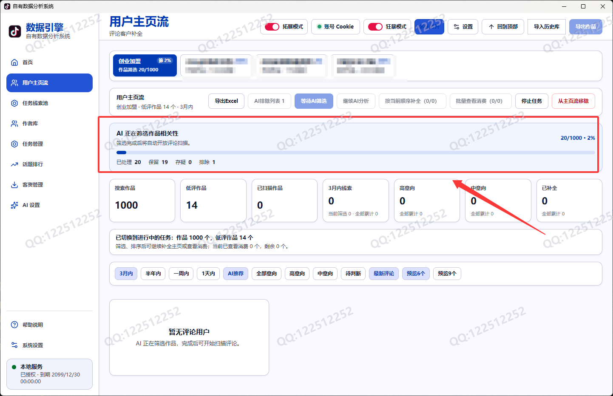
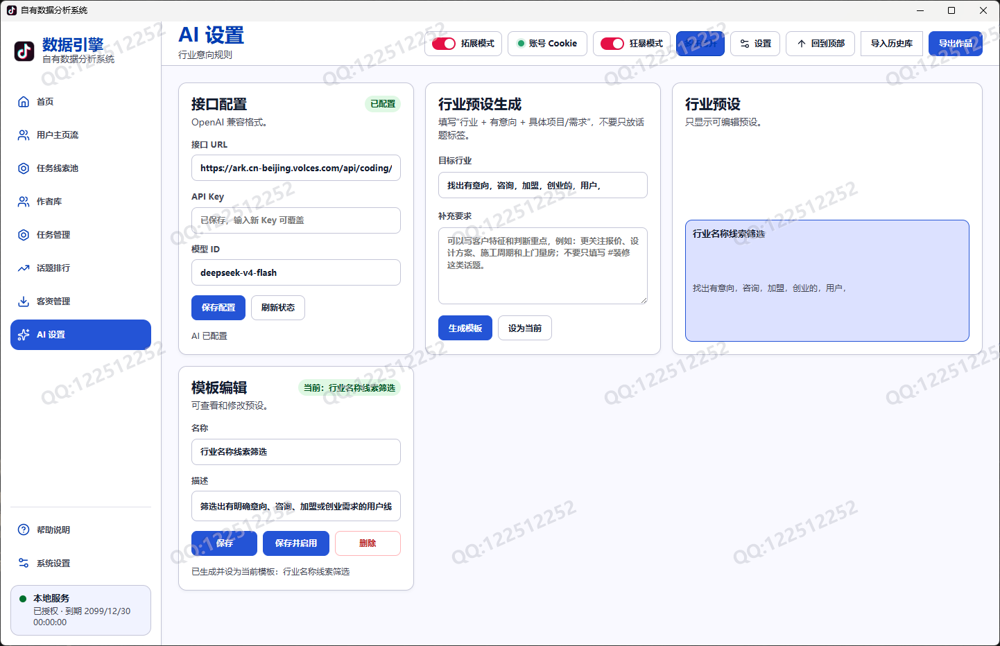
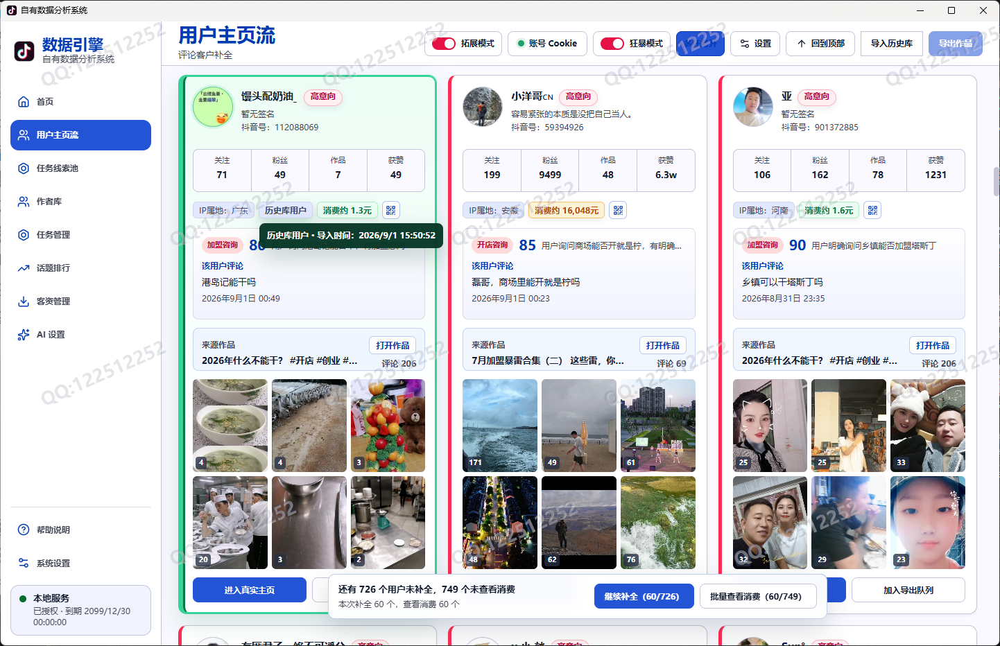
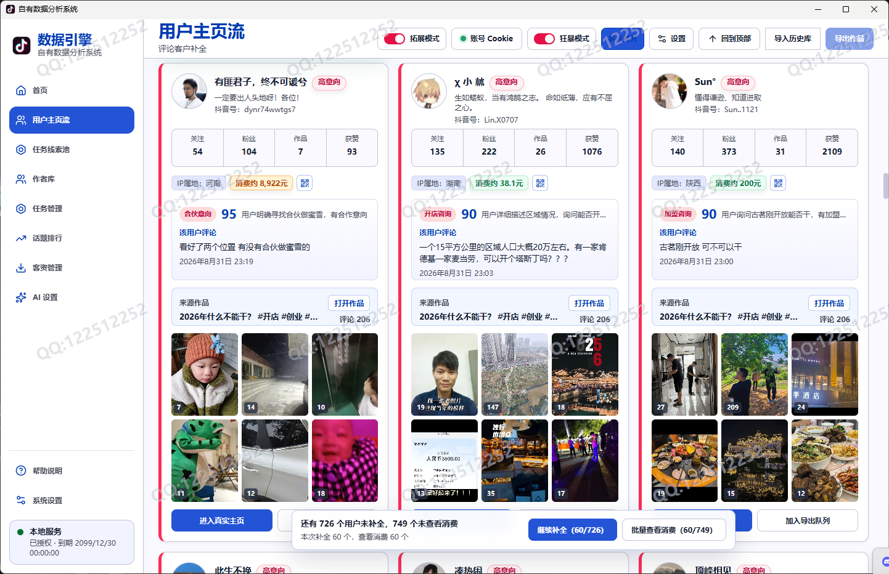
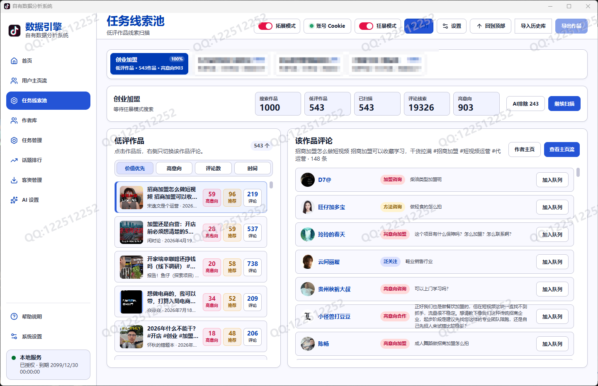
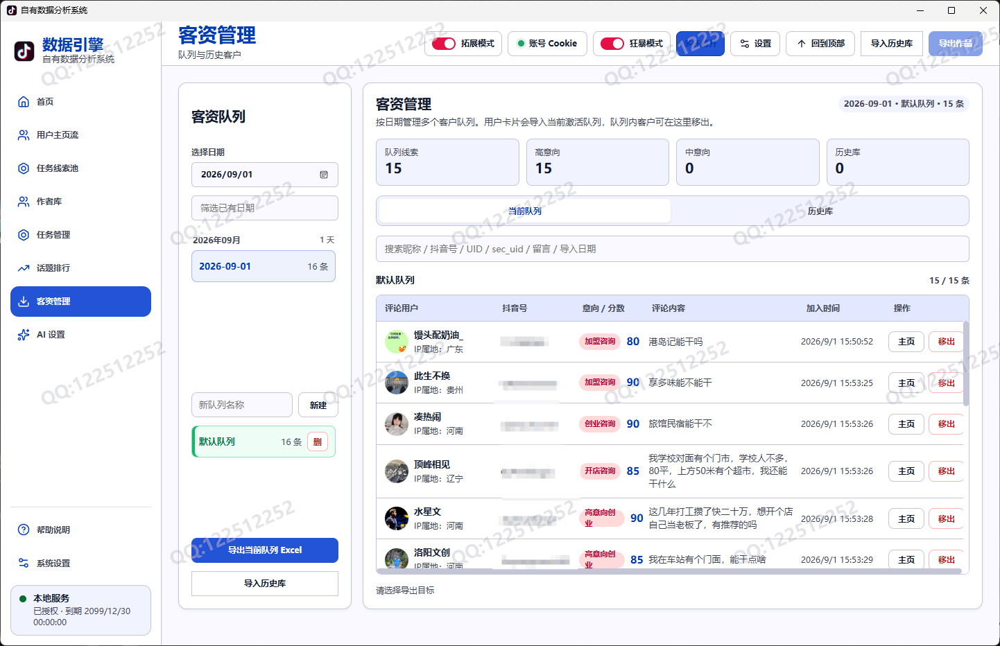
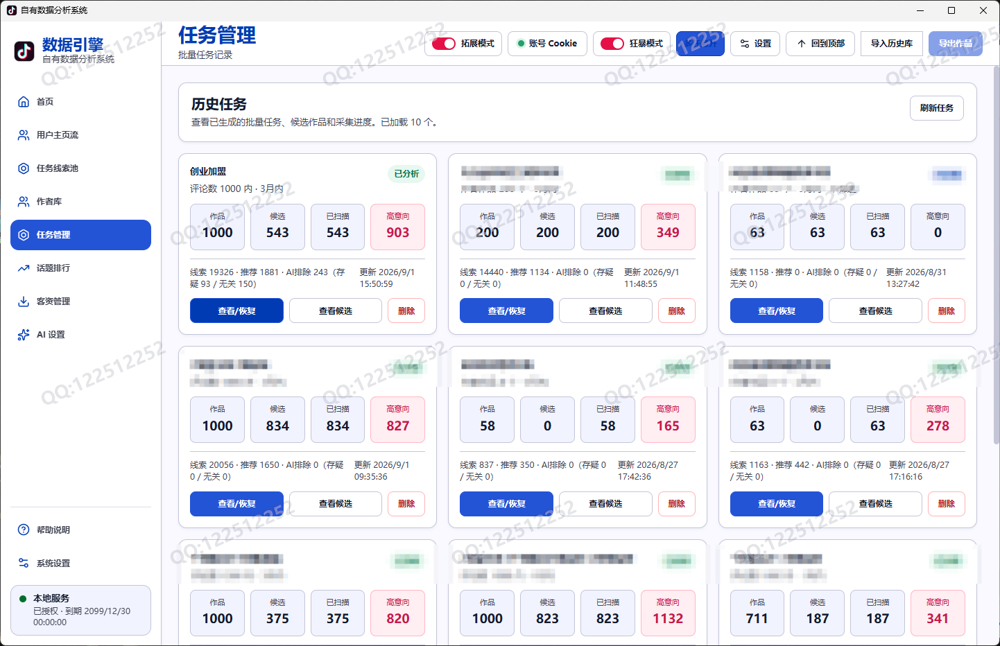

# 自有数据分析系统

面向抖音内容获客团队的作品分析、意向筛选与客资管理工作台。

## 不只是“采集”

传统采集工具通常停留在“搜到内容、抓到评论、导出表格”：数据很多，但真正值得跟进的人仍然要人工逐条判断。

自有数据分析系统把这段工作连成一条可执行的业务流程：

搜索作品 → 判断作品相关性 → 获取评论用户 → 识别客户意向 → 补全公开资料 → 查看消费参考 → 沉淀客资 → 导出跟进

系统的目标不是制造一张更大的名单，而是帮助团队更快找到更值得沟通的人，并让每一次筛选结果都能被保存、复盘和继续使用。

## 核心能力

### 1. 从关键词找到更多内容样本

- 支持行业词、话题词和组合关键词搜索。
- 支持单作品、作者主页和作者库等精准入口。
- 支持拓展搜索，适合行业调研和大样本获客任务。
- 搜索结果进入任务，切换页面不会丢失进度。

### 2. 先筛作品，再筛用户

抖音搜索结果并不总是与目标行业完全相关。系统先对作品做相关性判断，再进入评论用户分析，减少无关内容对后续结果的干扰。

作品会被分为：

- 相关：进入后续评论线索流程。
- 存疑：保留给人工复核，不轻易丢弃边界样本。
- 无关：进入排除列表，可统一移除，也可以逐条恢复或删除。

### 3. AI 辅助识别真实意向

系统结合评论内容、来源作品和行业预设，对评论用户进行意向分层：

- 高意向：出现明确咨询、价格、预约、加盟、方案或合作信号。
- 中意向：有了解、比较、地点、效果等潜在需求，但尚未明确行动。
- 待判断：信息不足或语义边界不清，留给后续人工判断。

AI 是筛选助手，不替代业务人员做最终判断。存疑用户和原始评论始终可以回看。

### 4. 行业预设适配不同业务

可以按行业目标和客户需求生成、编辑、保存多套预设，并随时切换当前规则。装修、医美、教育、招商等场景可以分别关注不同咨询信号，预设重新打开软件后仍可继续使用。

### 5. 主页流是持续工作的工作台

每个搜索任务都有自己的主页流。任务标签、筛选条件、排序方式、已查看位置和已显示数量都会被保留，团队可以在不同任务之间切换后继续工作。

用户卡片集中展示：

- 昵称、头像、抖音号或可识别的账号标识。
- IP 属地、关注、粉丝、作品和获赞等公开资料。
- 原始评论、评论时间、来源作品和 AI 意向。
- 历史库命中状态、消费参考和后续操作入口。

支持按当前筛选和排序继续显示、按顺序补全公开资料、批量查看消费以及加入客资队列。

### 6. 线索池让低评作品也有价值

对于评论量较低但可能有价值的作品，系统集中整理为任务线索池。左侧查看作品，右侧查看对应评论用户，方便结合作品上下文判断线索质量。

### 7. 作者库沉淀可重复研究的账号

看到值得持续观察的作者，可以加入作者库。作者库保存账号资料、公开作品和采集记录，支持进入主页、加载最新作品和发起精准采集。

适合建立同行账号样本库、持续跟踪垂直领域内容变化，以及对指定作者进行作品和评论分析。

### 8. 客资管理不让线索停在列表里

高价值用户可以加入按日期管理的客资队列：

- 支持多个业务队列，按销售、地区或活动分组。
- 支持历史客户导入，并标记已存在客户，减少重复跟进。
- 支持按昵称、账号标识、评论内容和导入日期检索。
- 支持导出 Excel，方便交给销售团队继续处理。

### 9. 任务可恢复，过程不会被打断

任务管理保存每次搜索和分析的完整档案。暂时从主页流移除只影响当前工作台，不会删除任务数据；需要时可以重新查看或恢复。

## 与传统采集工具的区别

| 对比项 | 传统采集工具 | 自有数据分析系统 |
| --- | --- | --- |
| 结果形态 | 一批作品或评论表格 | 从作品到客资的完整工作流 |
| 内容质量 | 搜到什么就全部保留 | 先做作品相关性筛选，保留相关与存疑样本 |
| 评论处理 | 人工逐条阅读 | AI 辅助识别高意向、中意向和待判断用户 |
| 行业适配 | 固定字段或固定关键词 | 可保存、切换多套行业预设 |
| 任务管理 | 一次性页面，容易丢进度 | 多任务标签、任务档案和可恢复工作台 |
| 用户资料 | 通常只有昵称和评论 | 资料、来源、意向、公开数据和消费参考集中呈现 |
| 重复客户 | 人工比对 | 历史库识别并提示已有客户 |
| 后续动作 | 导出后另行整理 | 直接加入客资队列、分组管理并导出 |
| 复盘能力 | 难以追溯筛选过程 | 保留作品、评论、筛选、任务和客户状态 |

## 推荐工作流

### 内容获客

1. 输入行业或话题关键词，设置目标数量和时间范围。
2. 查看作品相关性筛选结果，保留相关和需要复核的作品。
3. 进入主页流扫描评论，观察 AI 意向分层和原始评论。
4. 对高意向和中意向用户补全资料、查看消费参考。
5. 将值得跟进的用户加入客资队列并导出给销售。

### 同行与市场研究

1. 通过作者主页或作者库建立账号样本。
2. 加载最新公开作品，比较内容主题、互动和用户反馈。
3. 将多个任务结果保存，后续继续复盘。

### 历史客户去重

1. 导入已有客户表。
2. 新任务中识别历史库命中用户。
3. 只把新增且值得跟进的客户加入当前队列。

## 适合使用的团队

- 医美、装修、教育、招商、家装、婚庆等本地生活和服务行业。
- 需要从内容评论区寻找需求用户的销售团队。
- 需要建立同行账号、内容样本和行业线索库的运营团队。
- 希望把“人工看评论”变成可复用流程的中小企业。

## 使用边界

- 软件使用客户自己登录并授权的账号，不提供或附带任何第三方账号信息。
- AI 结果用于辅助排序和初筛，业务决策应由使用者结合原始内容确认。
- 使用者应遵守平台规则、适用的数据保护法律法规以及所在组织的授权制度。
- 请勿将软件宣传为“无限采集”“保证不触发风控”或其他无法保证的承诺。
- 本产品是独立第三方工具，与抖音官方不存在隶属、授权或合作关系；相关名称与商标归其权利人所有。
- 文档截图使用测试数据或已脱敏数据，实际功能与界面以购买版本为准。

## 获取产品与服务

这是面向商业团队的桌面工作台。购买授权、部署支持、行业预设定制和售后服务，请通过本仓库的联系方式或项目方提供的官方渠道咨询。

> 联系方式QQ:122512252。
